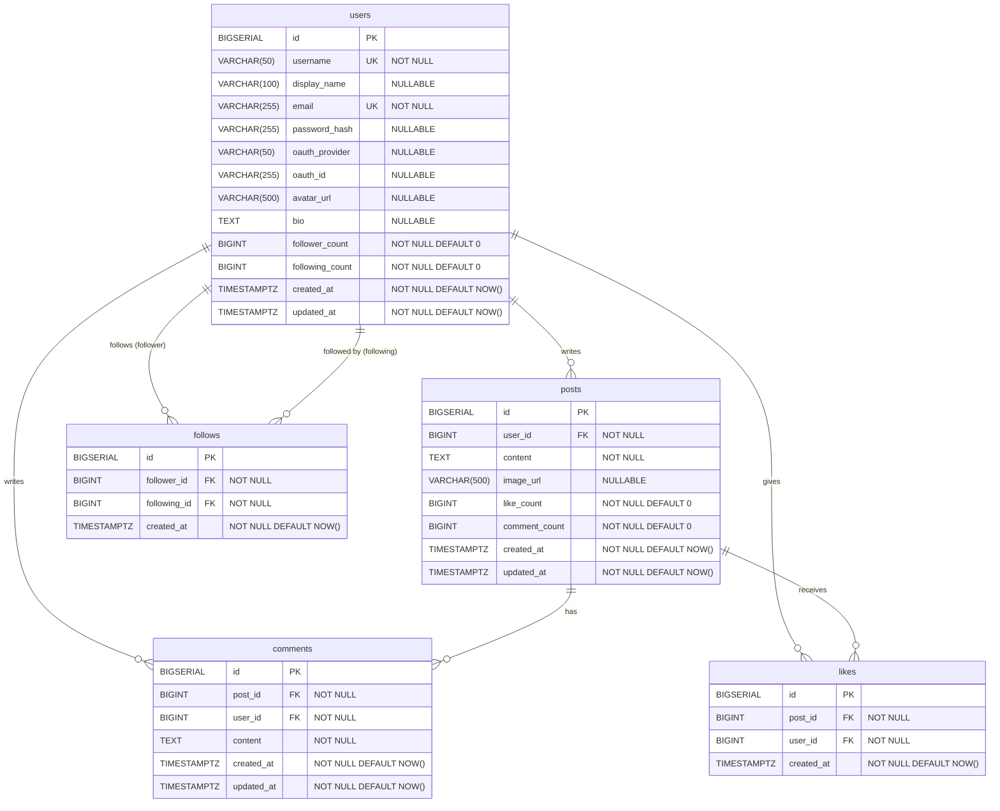

# TimeLine DB 設計書

**バージョン:** 1.1
**作成日:** 2026-05-17
**作成者:** Nakata Saki

---

## 1. 概要

本ドキュメントでは TimeLine アプリの PostgreSQL データベース設計を定義する。

### 設計方針

- 画像は URL 参照（VARCHAR）として保存。バイナリは AWS S3 に保存し、DB には持たない。
- `likes` テーブルに `UNIQUE(post_id, user_id)` を設け、1 ユーザー 1 投稿につき 1 いいねを DB レベルで強制する。
- `follows` テーブルに `UNIQUE(follower_id, following_id)` を設け、重複フォローを防ぐ。
- `posts.like_count` / `posts.comment_count` / `users.follower_count` / `users.following_count` は非正規化カウンタとし、集計コストを削減する。カウンタはサービス層で `+1/-1` 更新する。
- `users` テーブルは `password_hash`（メール認証）と `oauth_provider / oauth_id`（OAuth）の両列を持ち、認証方式の後決めに対応する。
- 主キーはすべて `BIGSERIAL`（自動採番 64-bit 整数）を使用する。
- タイムスタンプはすべて `TIMESTAMP WITH TIME ZONE`（`TIMESTAMPTZ`）を使用する。

---

## 2. ER 図

---

## 3. テーブル定義書

### 3.1 users テーブル

ユーザー情報を管理するテーブル。

| カラム名 | データ型 | NULL | デフォルト | 説明 |
|---------|---------|------|-----------|------|
| id | BIGSERIAL | NOT NULL | 自動採番 | 主キー |
| username | VARCHAR(50) | NOT NULL | — | ユーザー名（@username）。一意 |
| display_name | VARCHAR(100) | NULLABLE | — | 表示名。未設定の場合は username を表示 |
| email | VARCHAR(255) | NOT NULL | — | メールアドレス。一意 |
| password_hash | VARCHAR(255) | NULLABLE | — | bcrypt ハッシュ。OAuth のみの場合は NULL |
| oauth_provider | VARCHAR(50) | NULLABLE | — | OAuth プロバイダー名（例: `google`） |
| oauth_id | VARCHAR(255) | NULLABLE | — | OAuth プロバイダー側のユーザー ID |
| avatar_url | VARCHAR(500) | NULLABLE | — | アバター画像の S3 URL |
| bio | TEXT | NULLABLE | — | 自己紹介文 |
| follower_count | BIGINT | NOT NULL | 0 | フォロワー数（非正規化カウンタ） |
| following_count | BIGINT | NOT NULL | 0 | フォロー中ユーザー数（非正規化カウンタ） |
| created_at | TIMESTAMPTZ | NOT NULL | NOW() | 登録日時 |
| updated_at | TIMESTAMPTZ | NOT NULL | NOW() | 更新日時 |

**制約:**

| 制約名 | 種別 | 対象カラム | 内容 |
|--------|------|-----------|------|
| users_pkey | PRIMARY KEY | id | — |
| users_username_key | UNIQUE | username | ユーザー名の重複不可 |
| users_email_key | UNIQUE | email | メールアドレスの重複不可 |
| users_oauth_key | UNIQUE | (oauth_provider, oauth_id) | OAuth の重複不可 |

---

### 3.2 posts テーブル

ユーザーの投稿を管理するテーブル。

| カラム名 | データ型 | NULL | デフォルト | 説明 |
|---------|---------|------|-----------|------|
| id | BIGSERIAL | NOT NULL | 自動採番 | 主キー |
| user_id | BIGINT | NOT NULL | — | 投稿者の users.id（外部キー） |
| content | TEXT | NOT NULL | — | 投稿テキスト（最大 280 文字） |
| image_url | VARCHAR(500) | NULLABLE | — | 添付画像の S3 URL |
| like_count | BIGINT | NOT NULL | 0 | いいね数（非正規化カウンタ） |
| comment_count | BIGINT | NOT NULL | 0 | コメント数（非正規化カウンタ） |
| created_at | TIMESTAMPTZ | NOT NULL | NOW() | 投稿日時 |
| updated_at | TIMESTAMPTZ | NOT NULL | NOW() | 更新日時 |

**制約:**

| 制約名 | 種別 | 対象カラム | 内容 |
|--------|------|-----------|------|
| posts_pkey | PRIMARY KEY | id | — |
| posts_user_id_fkey | FOREIGN KEY | user_id → users(id) | ON DELETE CASCADE |
| posts_content_length_check | CHECK | content | char_length(content) <= 280 |

**インデックス:**

| インデックス名 | 対象カラム | 目的 |
|--------------|-----------|------|
| idx_posts_user_id | user_id | プロフィール画面の投稿一覧取得 |
| idx_posts_created_at | created_at DESC | タイムラインの新着順ソート |

---

### 3.3 comments テーブル

投稿に対するコメントを管理するテーブル。

| カラム名 | データ型 | NULL | デフォルト | 説明 |
|---------|---------|------|-----------|------|
| id | BIGSERIAL | NOT NULL | 自動採番 | 主キー |
| post_id | BIGINT | NOT NULL | — | 対象投稿の posts.id（外部キー） |
| user_id | BIGINT | NOT NULL | — | コメント投稿者の users.id（外部キー） |
| content | TEXT | NOT NULL | — | コメントテキスト |
| created_at | TIMESTAMPTZ | NOT NULL | NOW() | コメント日時 |
| updated_at | TIMESTAMPTZ | NOT NULL | NOW() | 更新日時 |

**制約:**

| 制約名 | 種別 | 対象カラム | 内容 |
|--------|------|-----------|------|
| comments_pkey | PRIMARY KEY | id | — |
| comments_post_id_fkey | FOREIGN KEY | post_id → posts(id) | ON DELETE CASCADE |
| comments_user_id_fkey | FOREIGN KEY | user_id → users(id) | ON DELETE CASCADE |

**インデックス:**

| インデックス名 | 対象カラム | 目的 |
|--------------|-----------|------|
| idx_comments_post_id | post_id | 投稿詳細画面のコメント一覧取得 |

---

### 3.4 likes テーブル

いいね情報を管理するテーブル。

| カラム名 | データ型 | NULL | デフォルト | 説明 |
|---------|---------|------|-----------|------|
| id | BIGSERIAL | NOT NULL | 自動採番 | 主キー |
| post_id | BIGINT | NOT NULL | — | 対象投稿の posts.id（外部キー） |
| user_id | BIGINT | NOT NULL | — | いいねしたユーザーの users.id（外部キー） |
| created_at | TIMESTAMPTZ | NOT NULL | NOW() | いいね日時 |

**制約:**

| 制約名 | 種別 | 対象カラム | 内容 |
|--------|------|-----------|------|
| likes_pkey | PRIMARY KEY | id | — |
| likes_post_id_fkey | FOREIGN KEY | post_id → posts(id) | ON DELETE CASCADE |
| likes_user_id_fkey | FOREIGN KEY | user_id → users(id) | ON DELETE CASCADE |
| likes_post_user_key | UNIQUE | (post_id, user_id) | 1 ユーザー 1 投稿につき 1 いいね |

---

### 3.5 follows テーブル

フォロー関係を管理するテーブル。

| カラム名 | データ型 | NULL | デフォルト | 説明 |
|---------|---------|------|-----------|------|
| id | BIGSERIAL | NOT NULL | 自動採番 | 主キー |
| follower_id | BIGINT | NOT NULL | — | フォローする側のユーザー（users.id） |
| following_id | BIGINT | NOT NULL | — | フォローされる側のユーザー（users.id） |
| created_at | TIMESTAMPTZ | NOT NULL | NOW() | フォロー日時 |

**制約:**

| 制約名 | 種別 | 対象カラム | 内容 |
|--------|------|-----------|------|
| follows_pkey | PRIMARY KEY | id | — |
| follows_follower_id_fkey | FOREIGN KEY | follower_id → users(id) | ON DELETE CASCADE |
| follows_following_id_fkey | FOREIGN KEY | following_id → users(id) | ON DELETE CASCADE |
| follows_pair_key | UNIQUE | (follower_id, following_id) | 重複フォロー不可 |
| follows_no_self_follow | CHECK | — | follower_id <> following_id（自己フォロー禁止） |

**インデックス:**

| インデックス名 | 対象カラム | 目的 |
|--------------|-----------|------|
| idx_follows_follower_id | follower_id | フォロー中ユーザーの一覧取得 |
| idx_follows_following_id | following_id | フォロワーの一覧取得 |

---

## 4. 関連ドキュメント

| ドキュメント | ファイル |
|------------|---------|
| 要件定義書 | [要件定義書.md](要件定義書.md) |
| インフラ構成書 | [インフラ構成書.md](インフラ構成書.md) |
| API 仕様書 | [API仕様書.md](API仕様書.md) |
