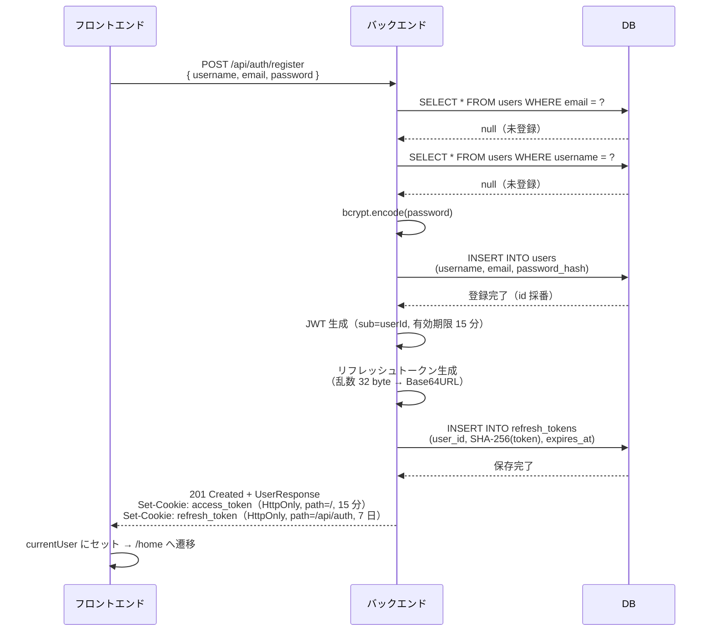
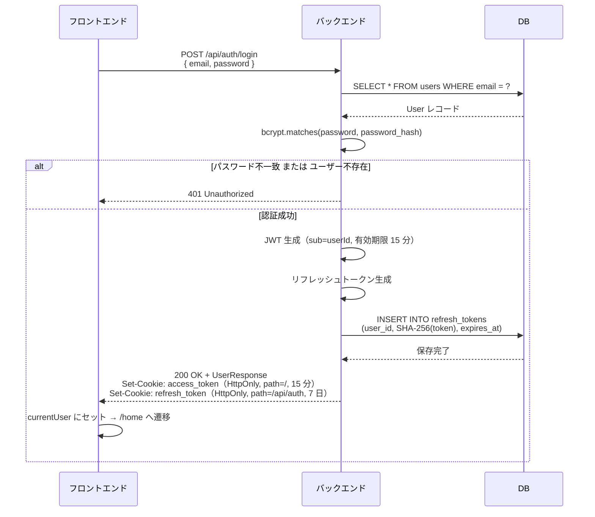
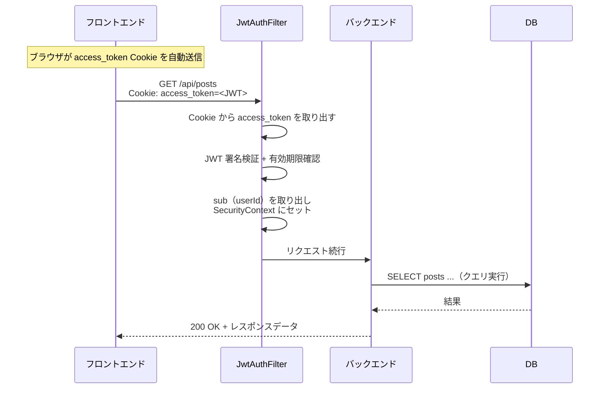
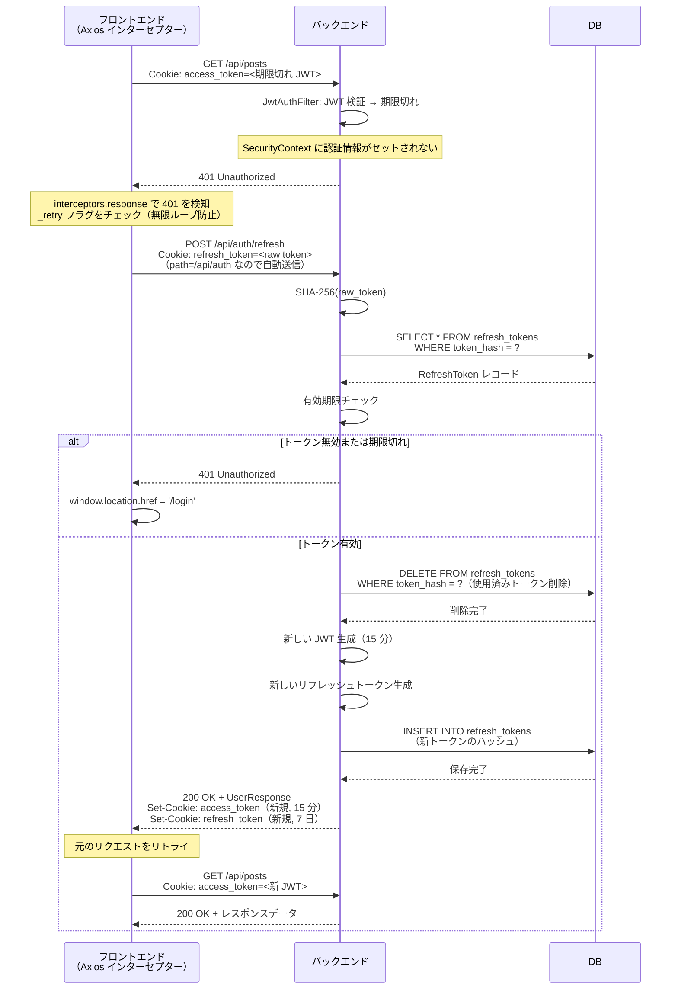
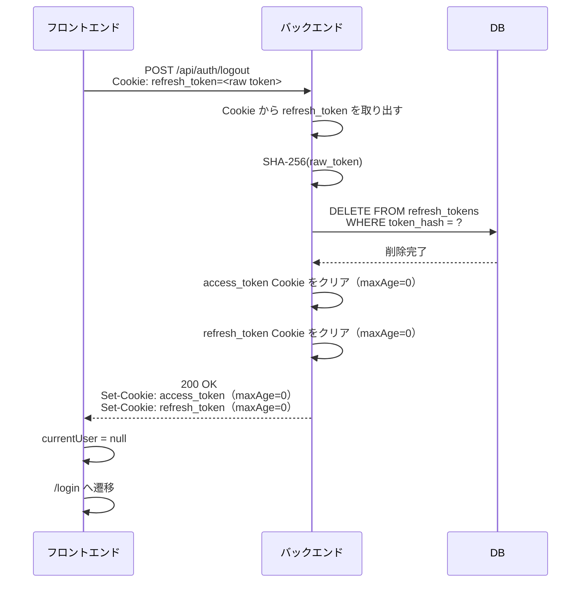
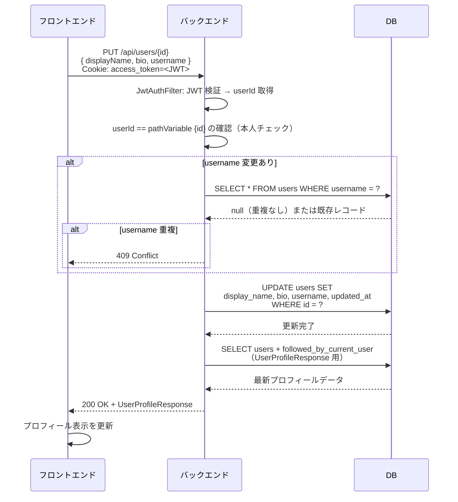
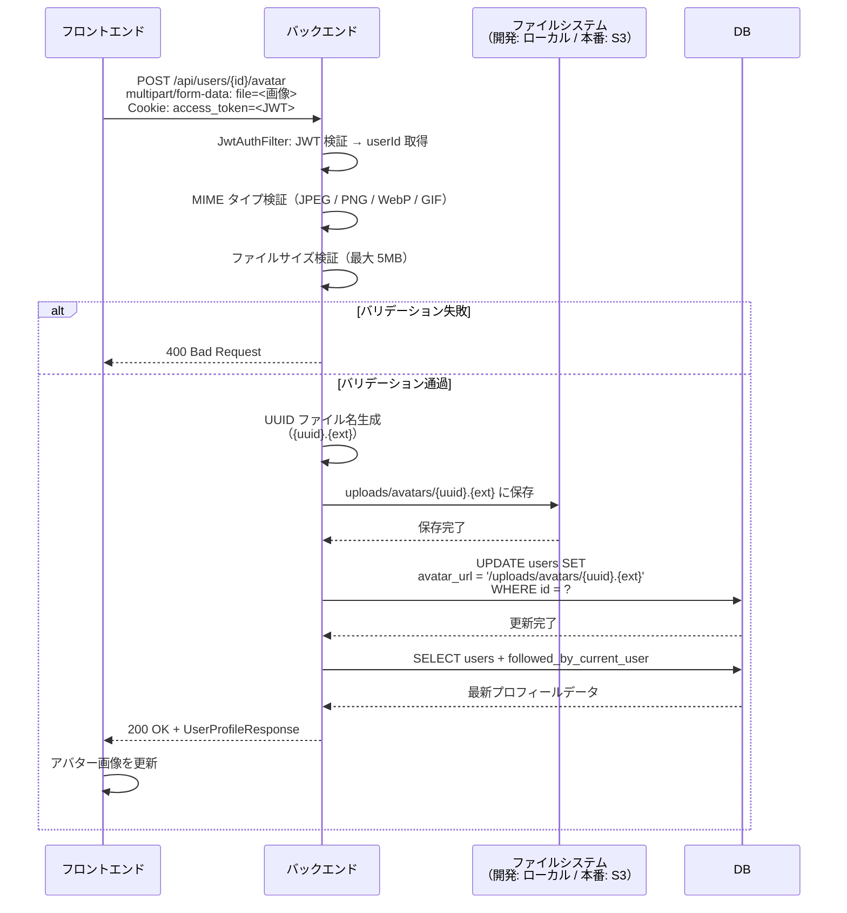

# TimeLine シーケンス図

**バージョン:** 1.0
**作成日:** 2026-05-24
**作成者:** Nakata Saki

---

## 概要

本ドキュメントでは、フロントエンド・バックエンド・DB 間の時系列インタラクションを定義する。
認証フロー（ログイン・自動リフレッシュ・ログアウト）とプロフィール編集（アバターアップロード）を対象とする。

### トークン仕様（前提知識）

| 種別 | 生成方式 | 有効期限 | Cookie 設定 |
|------|---------|---------|------------|
| アクセストークン | HMAC-SHA256 署名付き JWT（sub = userId） | 15 分 | HttpOnly, path=`/`, SameSite=Strict |
| リフレッシュトークン | 乱数 32 byte → Base64URL。DB には SHA-256 ハッシュのみ保存（ローテーション方式） | 7 日 | HttpOnly, path=`/api/auth`, SameSite=Strict |

`refresh_token` Cookie は path=`/api/auth` のため、`/api/auth/**` へのリクエスト時のみブラウザが自動送信する。

---

## 1. ユーザー登録

---

## 2. ログイン

---

## 3. 認証済み API リクエスト（通常時）

アクセストークンが有効な場合のリクエスト処理フロー。

---

## 4. アクセストークン自動リフレッシュ

アクセストークンが期限切れの場合、Axios インターセプターが自動的にリフレッシュして元のリクエストをリトライする。

---

## 5. ログアウト

---

## 6. プロフィール編集（アバターアップロード含む）

プロフィール情報の更新とアバター画像の変更は独立した 2 つのリクエストで行う。

### 6-1. プロフィール情報更新（displayName / bio / username）

### 6-2. アバター画像アップロード

---

## 関連ドキュメント

| ドキュメント | ファイル |
|------------|---------|
| 要件定義書 | [要件定義書.md](要件定義書.md) |
| DB 設計書 | [DB設計書.md](DB設計書.md) |
| 画面設計書 | [画面設計書.md](画面設計書.md) |
| フォロー機能定義書 | [機能定義書/フォロー機能定義書.md](機能定義書/フォロー機能定義書.md) |
| プロフィール機能定義書 | [機能定義書/プロフィール機能定義書.md](機能定義書/プロフィール機能定義書.md) |
