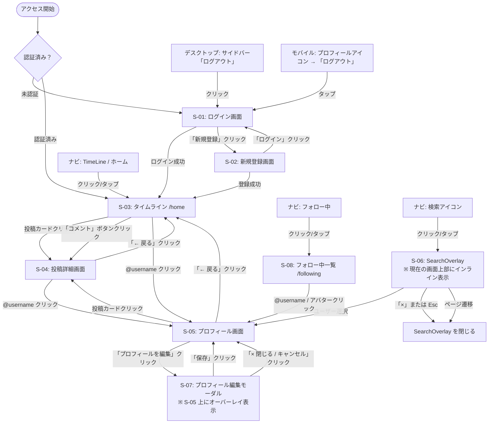

# TimeLine 画面遷移図

**バージョン:** 1.1
**作成日:** 2026-05-17
**作成者:** Nakata Saki

---

## 画面遷移図

---

## 画面遷移ルール一覧

| No | 出発画面 | トリガー | 遷移先 |
|----|---------|---------|--------|
| 1 | アクセス開始 | 未認証状態でアクセス | S-01: ログイン |
| 2 | アクセス開始 | 認証済み状態でアクセス | S-03: タイムライン |
| 3 | S-01: ログイン | ログイン成功 | S-03: タイムライン |
| 4 | S-01: ログイン | 「新規登録」クリック | S-02: 新規登録 |
| 5 | S-02: 新規登録 | 登録成功 | S-03: タイムライン |
| 6 | S-02: 新規登録 | 「ログイン」クリック | S-01: ログイン |
| 7 | S-03〜S-08（全認証済み画面） | ナビ「TimeLine」または「ホーム」クリック/タップ | S-03: タイムライン |
| 8 | S-03〜S-08（全認証済み画面） | ナビ「フォロー中」クリック/タップ | S-08: フォロー中一覧 |
| 9 | S-03〜S-08（全認証済み画面） | デスクトップ: サイドバー「ログアウト」クリック | S-01: ログイン |
| 10 | S-03〜S-08（全認証済み画面） | モバイル: プロフィールアイコンタップ →「ログアウト」タップ | S-01: ログイン |
| 11 | S-03〜S-08（全認証済み画面） | ナビ「検索」クリック/タップ | S-06: SearchOverlay を現在画面上部に表示（画面遷移なし） |
| 12 | S-06: SearchOverlay | ユーザー選択（クリック/タップ） | S-05: プロフィール（SearchOverlay を閉じて遷移） |
| 13 | S-06: SearchOverlay | 「×」ボタンまたは Esc キー | SearchOverlay を閉じる（画面遷移なし） |
| 14 | S-06: SearchOverlay | ページ遷移発生 | SearchOverlay を自動クローズ |
| 15 | S-03: タイムライン | 投稿カードクリック | S-04: 投稿詳細 |
| 16 | S-03: タイムライン | 「コメント」ボタンクリック | S-04: 投稿詳細 |
| 17 | S-03: タイムライン | @username クリック | S-05: プロフィール |
| 18 | S-04: 投稿詳細 | 「← 戻る」クリック | S-03: タイムライン |
| 19 | S-04: 投稿詳細 | @username クリック | S-05: プロフィール |
| 20 | S-05: プロフィール | 「← 戻る」クリック | S-03: タイムライン |
| 21 | S-05: プロフィール | 投稿カードクリック | S-04: 投稿詳細 |
| 22 | S-05: プロフィール | 「プロフィールを編集」クリック | S-07: プロフィール編集モーダル（S-05 上にオーバーレイ表示） |
| 23 | S-07: プロフィール編集モーダル | 「保存」クリック | S-05: プロフィール（モーダルを閉じて反映） |
| 24 | S-07: プロフィール編集モーダル | 「× 閉じる」/「キャンセル」クリック | S-05: プロフィール（モーダルを閉じる） |
| 25 | S-08: フォロー中一覧 | @username / アバタークリック | S-05: プロフィール |

---

## 関連ドキュメント

| ドキュメント | ファイル |
|------------|---------|
| 要件定義書 | [要件定義書.md](要件定義書.md) |
| 画面設計書 | [画面設計書.md](画面設計書.md) |
